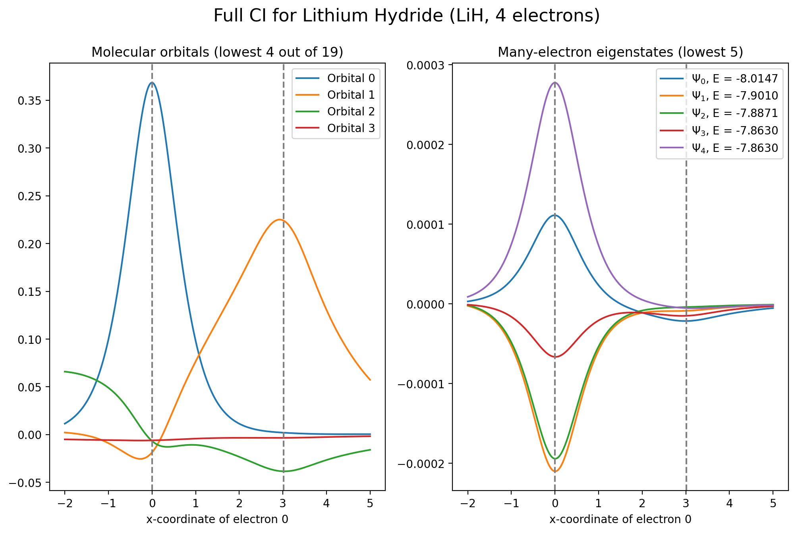

# Toy example on how to get excited states using Full CI

1. Run Hartree-Fock
2. Run Full CI
3. Evaluate basis functions
4. Evaluate orbitals as linear combinations of these basis functions
5. Evaluate determinants formed from orbitals
6. Evaluate wavefunction as linear combination of these determinants

This scales terribly, but is conceptually simple and probably reasonably accurate for tiny systems.
   
